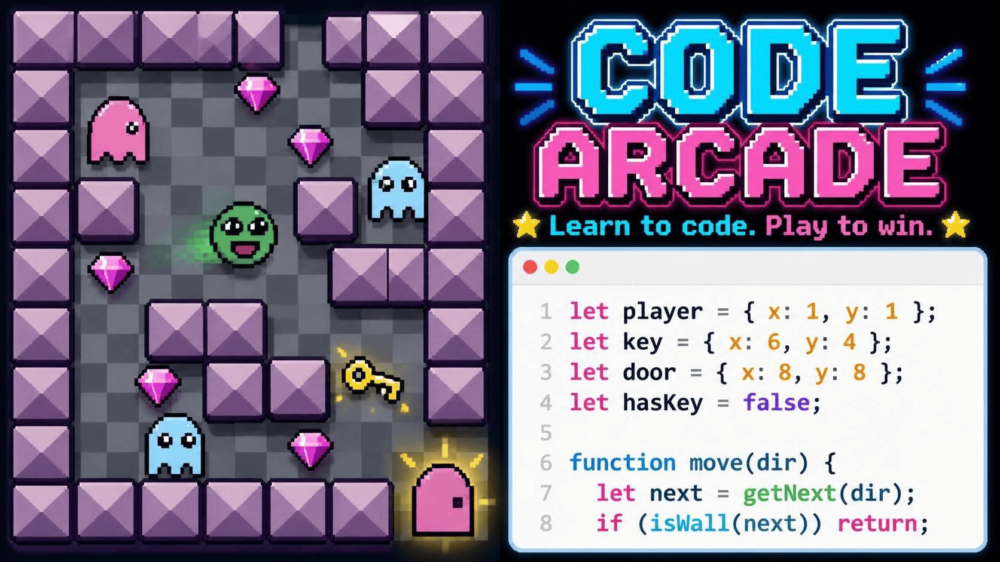

<p align="center">
  
</p>

# Code Arcade

[](https://github.com/remarkablegames/code-arcade/releases)
[](https://github.com/remarkablegames/code-arcade/actions/workflows/build.yml)

🕹️ Learn how to program with Code Arcade!

Play in your browser:

- [Wavedash](https://wavedash.com/games/code-arcade)
- [itch.io](https://remarkablegames.itch.io/code-arcade)
- [Newgrounds](https://www.newgrounds.com/portal/view/934247)
- [remarkablegames](https://remarkablegames.org/code-arcade/)

Or download for desktop:

- [Windows](https://github.com/remarkablegames/code-arcade/releases/latest/download/windows.zip)
- [macOS](https://github.com/remarkablegames/code-arcade/releases/latest/download/macos.zip)
- [Linux](https://github.com/remarkablegames/code-arcade/releases/latest/download/linux.zip)

Read the [blog post](https://remarkablegames.org/posts/code-arcade/).

## How to Play

Code Arcade is a puzzle game where you learn to program by writing and fixing JavaScript code to beat each level.

1. Each level presents a play area (the game) and a code editor containing the level's script.
2. Read the instructions in the play area and the comments in the code to figure out the objective.
3. Write or fix the JavaScript code in the editor.
4. Press **Run** to execute the code with the [KAPLAY.js](https://kaplayjs.com/) game engine.
5. Use **WASD** or the **arrow keys** to move the player (the bean) to the exit door. In some levels you must spawn the exit, collect a key, or fight off enemies.
6. Touch the door to advance to the next level.

Buttons:

- **► Run**: run the code in the editor
- **⟳ Restart**: restore the editor to the level's original code
- **ⓘ Hint**: display a hint in the game console

> The console in the play area reports output from `console.log()`, errors, and hints.

## Features

- **31 levels** that teach JavaScript programming concepts:
  - Outputting with `console.log` and errors
  - Single-line and multi-line comments
  - Data types: strings, numbers, booleans
  - Data structures: arrays, objects
  - Variables (`let`/`const`), template literals
  - Functions: declarations, function expressions, hoisting
  - Iteration: `for` loops, `forEach()`
  - Timing: `setTimeout()`, `setInterval()`
  - Object properties and methods
  - JSON: `JSON.stringify()`, `JSON.parse()`
  - DOM events: `addEventListener`
  - Promises: fulfilled, rejected, `then`/`catch`, `async`/`await`
  - Networking: `fetch()`
- Game built on the [KAPLAY.js](https://kaplayjs.com/) engine
- In-browser code editor powered by [CodeMirror](https://codemirror.net/) with JavaScript syntax highlighting
- Keyboard (WASD/arrow keys) and mouse controls
- Progress saved when level is cleared

## Credits

- Assets from [KAPLAY Crew](https://kaplayjs.com/crew/)
- Editor from [CodeMirror](https://codemirror.net/)

## Prerequisites

- [nvm](https://github.com/nvm-sh/nvm#readme)

## Install

Clone the repository:

```sh
git clone https://github.com/remarkablegames/code-arcade.git
cd code-arcade
```

Use the Node.js version:

```sh
nvm use
```

Install the dependencies:

```sh
npm install
```

## Available Scripts

In the project directory, you can run:

### `npm start`

Runs the game in the development mode.

Open [http://localhost:5173](http://localhost:5173) to view it in the browser.

The page will reload if you make edits.

You will also see any errors in the console.

### `npm run build`

Builds the game for production to the `dist` folder.

It correctly bundles in production mode and optimizes the build for the best performance.

The build is minified and the filenames include the hashes.

Your game is ready to be deployed!

### `npm run bundle`

Builds the game and packages it into a Zip file in the `dist` folder.

Your game can be uploaded to your server, [Itch.io](https://itch.io/), etc.

### `npm run increment-levels`

Increments a level and renames the file:

```sh
npm run increment-levels -- --level=<number>
```

## Testing

Jump to a level by passing it as a query string (overrides the saved level in `localStorage`):

```
http://localhost:5173/?level=<number>
```

For example, to play level 10:

```
http://localhost:5173/?level=10
```

## License

[MIT](LICENSE)
